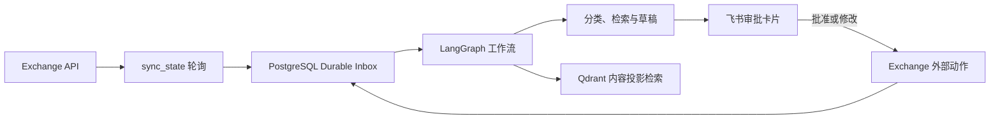

# AI Exchange

> 面向单个 Exchange 账户的 AI 邮件助手：以增量轮询可靠收件、用 LangGraph 编排处理流程，并通过飞书审批卡片把外部动作交还给人确认。

`Polling-only` · `Greenfield database` · `Single account` · `Single process`

AI Exchange 不直接暴露 Exchange 入站 Webhook。它通过 Exchange API 的 `sync_state` 增量同步发现变化，先写入 PostgreSQL Durable Inbox，再进行分类、检索、草稿生成与人工审批。Qdrant 仅保存经过内容投影后的检索数据，不承载原始附件或 Base64 内容。

## 能做什么

- **可靠收件**：轮询变化先持久化到 Durable Inbox，避免网络或模型调用失败直接丢失邮件事件。
- **邮件理解与草稿**：使用可配置的 LLM 对邮件分类、检索相关历史、生成回复草稿和建议动作。
- **飞书人工审批**：将草稿和操作建议发送为飞书交互卡片；批准、拒绝或修改后才执行对应外部动作。
- **安全的外部副作用**：远端结果不确定时进入 `manual_review`，而不是盲目重试并造成重复发信或重复卡片。
- **可审计运行**：轮询权限、运行时状态、发布 manifest 和数据库角色边界都有显式校验。

## 处理流程



## 当前边界

- 唯一邮件入口是轮询；没有 HTTP Webhook 路由、Webhook 密钥或订阅管理。
- 只支持**全新、空的数据库初始化**。不要接入旧版数据库、旧 Compose volume 或历史 Alembic revision。
- 首次同步只建立 `sync_state` 基线，不会把已有历史邮件批量送入处理队列；之后才处理增量变化。
- 部署形态固定为一个应用进程、一个 Exchange 账户与一个飞书账户；不要横向扩容应用服务。
- Tier1 v1 声明式规则通过固定摘要的编译产物接入默认路由；规则冲突、产物失效或下游模型异常都失败关闭到人工复核。
- 偏好/风格记忆学习默认关闭。只有经过单独评审后显式设置 `MEMORY_LEARNING_ENABLED=true` 才允许写入学习结果。

## 本地开发

需要 Docker Desktop 或 OrbStack、Git、Python 3.12 与 `uv`。macOS 示例：

```bash
brew install uv
uv python install 3.12
uv venv --python 3.12 .venv
uv sync --frozen --group dev

.venv/bin/ruff check src/ scripts/ tests/
.venv/bin/python -m pytest -q
```

Docker 镜像固定使用 Python 3.12；本机其他 Python 版本仅用于开发便利，不应当作部署基线。

## 从空环境首次部署

首次部署应使用新的 Compose project 和新的命名卷。只有在操作者明确授权永久清空、且脚本通过 Compose 标签核对精确资源边界时，才可对一个已知项目执行 `greenfield-reset`；该命令不提供升级或数据保留。详细的发布证据、manifest、私网 TLS 与 checkpoint 维护步骤见 [部署说明](deploy/README.md)。

### 1. 配置集成参数

```bash
cp .env.example .env
# 编辑 .env：只填写 16 个服务、Exchange、飞书和模型集成字段
.venv/bin/python scripts/configure_deployment.py \
  --project-name ai-exchange-greenfield
```

配置工具把数据库角色、DSN、指标 token、内容加密密钥和内部部署状态写到被 Git 忽略的 `secrets/`；不要提交或打印其中内容。

### 2. 选择运行模式并检查配置

生产环境要求 Exchange 使用可验证的 HTTPS：

```bash
.venv/bin/python scripts/deploy_system.py check \
  --project-name ai-exchange-greenfield
```

若 Exchange 是本机、私网或非 HTTPS 的受控开发端点，显式使用开发模式：

```bash
.venv/bin/python scripts/deploy_system.py check \
--development --project-name ai-exchange-greenfield
```

`--development` 仍使用同一个 `docker-compose.yml`，仅将应用绑定到回环地址并启用
`operations-console` profile；不会降低 TLS 或数据库运行时安全校验。

### 3. 初始化空数据库与轮询权限

只在已提交且工作树干净的 revision 上执行。以下命令只建立基础服务与数据库基线；接着必须按照 [部署说明](deploy/README.md) 生成发布证据、`POLICY.json` 和 `CONTRACT.json`，并使用 `ingestion-maintenance initialize` 写入运行时授权。

```bash
PROJECT_NAME=ai-exchange-greenfield
COMPOSE=(docker compose --env-file .env --project-name "$PROJECT_NAME")
if [[ -f secrets/deployment.env ]]; then
  COMPOSE=(docker compose --env-file secrets/deployment.env --env-file .env --project-name "$PROJECT_NAME")
fi

"${COMPOSE[@]}" config --quiet
"${COMPOSE[@]}" build ai-assistant-service
"${COMPOSE[@]}" up -d postgres qdrant
"${COMPOSE[@]}" --profile database-provision run --rm database-provision
"${COMPOSE[@]}" --profile migration run --rm database-bootstrap
```

`database-provision` 和 `database-bootstrap` 只接受空应用数据库。失败时不要拿旧库重试：修正原因后，换一个新的 project/volume 从头开始。

### 4. 启动并验证

完成 manifest 初始化后重建应用并等待真实就绪状态：

```bash
.venv/bin/python scripts/deploy_system.py redeploy \
  --project-name "$PROJECT_NAME"
```

本机/受控开发环境则使用：

```bash
.venv/bin/python scripts/deploy_system.py redeploy \
  --development --project-name "$PROJECT_NAME"

curl --fail http://127.0.0.1:8000/ready
curl --fail http://127.0.0.1:8000/health
```

`/ready` 必须同时返回 `status=ready` 与 `processing=active`。健康接口仅代表应用可用；仍应通过受保护的 `/queue`、`/metrics` 和一次真实的非破坏性邮件流，分别验证轮询、Durable Inbox、审批与外部动作。

## Operations Console（本地操作台）

Operations Console 是本机、单操作员工具，不是生产 FastAPI 路由，也不会加入生产
Compose。它通过独立的只读 PostgreSQL 角色读取 Pipeline Trace，并把 Rule Draft
写回当前工作树的 `tier1_rules/`；它不会提交 Git、重启服务或热加载规则。

首次为已完成数据库初始化的环境创建只读角色时，管理员 DSN 只能通过私有文件提供：

```bash
.venv/bin/python scripts/provision_operations_console.py \
  --admin-dsn-file /path/to/private/admin-dsn \
  --dsn-output /path/to/private/operations-console-dsn
```

随后用同一个 Compose project 启动 API 和 dashboard 前端容器：

```bash
.venv/bin/python scripts/deploy_system.py redeploy --development \
  --project-name ai-exchange-greenfield

cd console-web
npm install
npm run dev
```

API 容器名为 `ai-exchange-operations-console-api`，浏览器访问
`http://127.0.0.1:5173`，前端容器名为
`ai-exchange-operations-dashboard`。规则的 `Validate` 使用真实
`compile_registry()`，`Compile artifact` 只写本地 digest-addressed artifact；生效
仍需人工提交并运行 `scripts/deploy_system.py` 的既有发布流程和计划重启。完整接口与
边界见 [Operations Console ADR](docs/adr/0017-operations-console-contract.md)。

## 日常运维

| 目标 | 入口 |
| --- | --- |
| 检查或重建应用 | `scripts/deploy_system.py check\|redeploy` |
| 查看、暂停或恢复轮询 | `scripts/manage_ingestion.py status\|pause\|resume-ingress` |
| 受审计地重新处理邮件 | `scripts/manage_ingestion.py requeue` |
| 维护 LangGraph checkpoint | `scripts/checkpoint_cleanup.py` |

运行时控制写操作必须提供 actor、reason 与 idempotency key。不要把 `manual_review` 记录当作可自动重试的任务；在重试前先核对 Exchange 和飞书的真实结果。

## 切换与清理旧部署

新项目完成真实业务验证前，不要停止旧实例。两套实例不能同时对同一账户进行活跃轮询。

确认切换成功后，先核对旧 Compose project 的实际归属，再只对该项目执行：

```bash
docker compose --project-name <old-project> down --volumes --remove-orphans
```

该命令会删除目标项目的容器和命名卷。不要删除 `secrets/`，也不要将此命令用于新项目、共享卷或其他 Docker 项目。

## 相关文档

- [首次部署与发布证据](deploy/README.md)
- [绿地基线 ADR](docs/adr/0009-greenfield-only-cleanup-baseline.md)
- [记忆学习显式启用 ADR](docs/adr/0010-explicit-memory-learning-activation.md)
- [Tier1 路由设计](docs/tier1-routing-design.md)
- [Tier1 决策与原子激活 ADR](docs/adr/0008-tier1-decision-model-and-atomic-activation.md)
