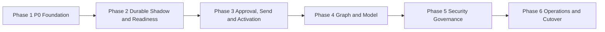

# AI-Exchange Full Remediation Master Implementation Plan

> **For agentic workers:** REQUIRED SUB-SKILL: Use superpowers:subagent-driven-development (recommended) or superpowers:executing-plans to implement this plan task-by-task. Steps use checkbox (`- [ ]`) syntax for tracking.

**Goal:** 将 AI-Exchange 从依赖进程内队列和大型 LangGraph checkpoint 的现状，渐进改造成 PostgreSQL 事实源、Webhook + Sync 补偿、审批与发送可审计且不会自动重复发送的生产级邮件助手。

**Architecture:** 实施分成六个可独立验收的子计划，严格按依赖顺序执行。阶段 1 先止血并建立 Alembic 与最小 ContentStore；Phase 2 交付 dormant 持久化收件、Shadow 与 readiness；Phase 3 实现审批/发送、唯一 authority mutation 和 versioned barrier consumer；Phase 4/5/6 依次追加 Graph/Projection、安全治理与运营能力 successor。只有 Phase 6 完成且后续 extension v2 真实证据生成完整 `production_ready` successor 后，Phase 3 的唯一入口才允许真实 switch。

**Tech Stack:** Python 3.12、FastAPI、Pydantic 2、psycopg 3、Alembic、PostgreSQL 15、LangGraph 1.x、Qdrant、httpx、lark-oapi、Prometheus、structlog、pytest、uv、Docker Compose。

## Global Constraints

- 本计划只修改 `/Users/jarod/Documents/AI-Exchange`；`/Users/jarod/Documents/exchange-feishu-extension` 在全部当前项目验收前保持只读。
- PostgreSQL 是唯一业务事实来源；LangGraph checkpoint、Qdrant 和飞书卡片均为可恢复执行或投影视图。
- 收件采用已批准的 Webhook 实时触发 + 每 5 分钟 `/emails/sync` 增量补偿。
- 发布采用方案 B：Phase 2 只能交付 dormant Durable 实现、Shadow 对比和不可变 readiness，生产 authority 不得进入 `durable_active`；Phase 3 必须先完成审批/Outbox/Lark action authority、source-delete race 与全部旧卡失效证明，再执行唯一的 fenced 原子激活。
- 当前 extension/exchangelib v5.6.0 已确认与 `exchange_sync_contract_v2` 不兼容：generator 被整体分页消费而非 HTTP 总量受 `limit` 约束，且原样返回 `read_flag_change`/`item=None`。AI 客户端保持 bounded/fail-closed；后续 extension 必须提供有界页、continuation/`includes_last` 和版本化 read-flag 映射，真实探针证明后才能解除 `blocked_external_exchange_sync_contract`。本轮不得修改服务端或把 mock 当成生产证据。
- reply/forward 在超时、断连、发送开始后进程崩溃或可能发生在远端执行后的 5xx 时进入 `send_unknown`，禁止自动重试。
- 请求可能已写出后，普通/畸形/代理注入的 HTTP 4xx 也不能证明未发送；当前只有 transport 证明零请求字节才是 `proven_not_sent`，未来服务端 discriminator 必须版本化且可认证。
- `send_unknown` 重新发送必须有新的人工授权、新的 `send_intents` 和新的 Send Outbox；旧尝试保持不可变。
- 普通 `/send` 的 HTTP 200 仅表示 `accepted`，没有状态证据时不得标记为 `sent`。
- Graph State 禁止保存正文、HTML、Base64、图片字节、完整附件、完整模型请求或完整飞书卡片。
- 应用业务表由 Alembic 管理；LangGraph checkpoint 迁移由独立 autocommit 引导命令管理。
- 生产环境强制 Exchange TLS 校验，禁止自动降级为 `verify=False`。
- 新 Durable/current 与 Durable rollback compatibility 路径的所有外部副作用必须通过四类业务 Outbox；迁移期 legacy-authoritative/Shadow 为保持现网连续性，仅允许 `LegacyProcessingAdapter` 通过 exact `LegacyEffectGuard`/`pipeline_legacy_effects` 执行既有直接副作用。切换后新 current generation 只能走 Durable adapters，旧 generation 只排已 stamped guarded work；Phase-6 硬稳定门禁和 migration-role contraction 后才删除兼容路径。模型永远不能直接发送邮件、访问任意文件或访问内部网络。
- `DurableInboxWorker` 必须从 Inbox 的 immutable pipeline/generation/fence 和当前 DB authority 选择 adapter：normal current -> `DurableProcessingAdapter`，forward-only rollback current -> `DurableLegacyCompatAdapter`，pre-switch legacy/Shadow 或 old draining stamp -> `LegacyProcessingAdapter`；禁止跨 lane fallback。
- 每个 Inbox 与 Notification/Mailbox/Send/Projection Outbox 均固化 `generation` 和 `fencing_token`，claim/complete 都验证；账户开关不授予执行权。
- 六个按账户期望开关为 `DURABLE_INBOX_ENABLED`、`SYNC_RECONCILIATION_ENABLED`、`NEW_APPROVAL_FLOW_ENABLED`、`SEND_OUTBOX_ENABLED`、`LIGHTWEIGHT_GRAPH_STATE_ENABLED`、`QDRANT_OUTBOX_ENABLED`。
- 每个任务先写失败测试，再写最小实现，再运行定向测试和阶段回归，最后提交。
- 每次暂存前运行 `git status --short` 和 `git diff --check`，只暂存任务列出的路径；不得覆盖、reset 或 checkout 用户已有修改。
- 当前工作区已有 49 个预存未提交文件。执行前必须先完成阶段 1 的“预存修改归档”任务，不得把它们混入后续功能提交。
- 全局覆盖率最终不少于 80%，可靠性关键模块不少于 90%；覆盖率采用只升不降 ratchet。

---

## Plan Suite

| 顺序 | 子计划 | 可独立交付结果 |
|---|---|---|
| 1 | `2026-07-10-ai-exchange-phase-1-p0-foundation.md` | P0 数据丢失、近 OOM、百万 Token、迁移、安全暴露得到止血 |
| 2 | `2026-07-10-ai-exchange-phase-2-durable-ingestion.md` | dormant Webhook/Sync/Worker、Shadow 对比、历史隔离、代次 fencing 与不可变 readiness 能力；当前 extension 下明确 external-blocked，不激活生产 Durable 路径 |
| 3 | `2026-07-10-ai-exchange-phase-3-approval-send.md` | 不可变审批快照、动作 CAS、Outbox、`send_unknown` 人工恢复、旧卡失效与唯一 Durable 原子激活能力；真实 switch 受 v2 外部 gate 约束 |
| 4 | `2026-07-10-ai-exchange-phase-4-graph-model-projection.md` | Dormant/current-authority-selected 轻量 Graph、T1→T2→T3、ContentStore 生命周期、统一模型网关与 Projection Outbox；external-blocked 时保留 guarded legacy 连续性 |
| 5 | `2026-07-10-ai-exchange-phase-5-security-governance.md` | 飞书 RBAC、安全预览、HTML/PDF/附件、模型数据治理、容器纵深防御 |
| 6 | `2026-07-10-ai-exchange-phase-6-operations-cutover.md` | 真实指标、告警、CI/构建、保留清理、激活后运营/收缩能力，以及当前 external-blocked 实现验收与后续生产验收 |

锁定的 pre-activation implementation 单头迁移链为：`0003 durable ingestion -> 0004 ignored policy -> 0005 sync control -> 0006 shadow inputs -> 0007 runtime authority -> 0008 approval/send + activation successor contract -> 0009 content lifecycle -> 0010 projection outbox -> 0011 preview nonce -> 0012 retention control -> 0013 operations control -> 0014 legacy contraction control`。每个 revision 的任务必须同提交更新 exact head/schema digest、bootstrap、四角色 ACL、checkpoint allowlist、offline SQL，并用全部相关 profile disabled 的 code-first real-PostgreSQL old-head→new-head bridge、空库、二次 no-op 和旧 binary 拒绝测试。Production activation 发生在 `0014`；真实激活、至少七天/1,000 事件稳定窗及 sealed authorization 后，独立审查的 migration-role `0015 legacy contract DDL` 才执行 actual rename/view/revoke，并带完整 `0014 -> 0015` bridge/ACL/schema/offline tests。唯有严格证明无 account/authority/business/legacy/switch/history 痕迹的 pristine fresh install 可无授权直接建 `0015` final schema；任何痕迹强制 production authorization 分支。只有 `0015` 和后续代码移除门禁通过，production final head 才是 `0015` 并可称 `production_contracted`。

Activation successor 顺序同样锁定：`phase3_base -> phase4_graph_projection -> phase5_security_governance -> phase6_implementation_complete_external_blocked -> production_ready`。前四者仅封存实现 capability，不触发 quiesce/card invalidation/LB/credential isolation，也不可消费，现网 legacy/Shadow 必须继续工作。未来真实 v2 后先持久化 target reservation，再完成一个独立 Phase-2 live cutover barrier；最终 `production_ready` 同时自链 Phase-6 capability leaf、FK 绑定 ready live barrier及其 reserved generation/fence，并包含全量当前 head/四 Outbox/Graph/安全/运营/切换证据。只有 Phase-3 `ActivationService` 可在同事务写 consumption+switch receipt 并原子修改 authority。

依赖关系：



## Locked File Structure

新增文件按业务边界组织，现有大文件只保留兼容适配器：

```text
alembic/
  env.py                         # 仅应用业务表迁移环境
  versions/                     # 按阶段追加迁移
src/db/
  bootstrap.py                  # Alembic + LangGraph autocommit 引导命令
  schema.py                     # 启动时只读版本检查
  unit_of_work.py               # PostgreSQL 事务边界
src/storage/
  content_store.py              # ContentStore Protocol 与不可变 DTO
  encrypted_files.py            # AES-GCM 文件实现
  backend.py                    # 多后端字节存储 Port
  repository.py                 # 账户域内去重、引用与保全元数据
  migration.py                  # 历史内容幂等迁移
  rotation.py                   # 密钥版本轮换
  gc.py                         # 引用/保全感知的安全 GC
src/domain/
  errors.py                     # 统一错误类别
  email_state.py                # 状态和允许转换
src/ingestion/
  models.py                     # InboxEvent、SyncCursor、ChangeType
  repository.py                 # Inbox/Cursor/Email 聚合持久化
  worker.py                     # 固定 Worker 与租约
  sync.py                       # 5 分钟增量协调器
  ownership.py                  # current_ingress/draining/retired + fencing
src/approval/
  models.py                     # DraftVersion、ApprovalAction、SendIntent
  repository.py                 # 审批 CAS 与不可变快照
  service.py                    # 飞书动作业务入口
src/outbox/
  repository.py                 # 通用 Outbox 领取接口
  notification.py               # 飞书 at-least-once 投递
  mailbox.py                    # mark_read 等幂等邮箱动作
  send.py                       # 发送专用 write-ahead 与 send_unknown
src/llm/
  budget.py                     # Token/字节硬闸门
  gateway.py                    # 单层重试、限流、断路器与 Schema
  policy.py                     # 账户级供应商与数据策略
src/security/
  auth.py                       # 内部接口与飞书身份授权
  service_auth.py               # Webhook/Metrics/管理接口认证
  preview.py                    # SSO/一次性 Token 会话
  html.py                       # HTML 白名单与 CSP
  pdf.py                        # WeasyPrint 拒绝外部资源
  attachments.py               # 魔数、大小、像素与压缩检查
  redaction.py                  # 日志字段脱敏
src/maintenance/
  checkpoint_cleanup.py         # dry-run/备份后 checkpoint 清理
  retention.py                  # 内容、Outbox、Qdrant、日志保留
  cutover.py                    # 高水位对账与 generation 切换
src/runtime/
  resources.py                  # 客户端/Worker/连接池生命周期
  blocking.py                   # 有界线程/进程执行器
src/operations/
  alerts.py                     # 状态化告警规则
  runbooks.py                   # 告警到 Runbook 映射
src/projections/
  qdrant.py                     # 终态邮件投影 DTO 与幂等 Upsert/Delete
```

## Cross-Plan Interfaces

后续计划必须复用以下名称，不得自行改名：

```python
from dataclasses import dataclass
from datetime import datetime
from enum import StrEnum
from typing import Any, Mapping, Protocol, Sequence


class ErrorKind(StrEnum):
    VALIDATION = "validation_error"
    AUTHENTICATION = "authentication_error"
    RATE_LIMITED = "rate_limited"
    TRANSIENT_DEPENDENCY = "transient_dependency_error"
    PERMANENT_DEPENDENCY = "permanent_dependency_error"
    POLICY_REJECTED = "policy_rejected"
    SEND_UNKNOWN = "send_unknown"
    INTERNAL_INVARIANT = "internal_invariant_error"


@dataclass(frozen=True)
class ContentRef:
    account_id: int
    object_id: str
    key_version: str
    sha256: str


class ContentStore(Protocol):
    async def put_email(self, account_id: int, email_id: str, email: Mapping[str, Any]) -> ContentRef:
        raise NotImplementedError

    async def load_email(self, ref: ContentRef, *, include_attachments: bool = False) -> dict[str, Any]:
        raise NotImplementedError

    async def delete(self, ref: ContentRef) -> None:
        raise NotImplementedError


class PipelineGenerationState(StrEnum):
    CURRENT_INGRESS = "current_ingress"
    QUIESCING = "quiescing"
    DRAINING = "draining"
    RETIRED = "retired"


@dataclass(frozen=True)
class ExchangeResult:
    outcome: str
    status_code: int | None
    remote_operation_id: str | None
    response_fingerprint: str | None


@dataclass(frozen=True)
class SendAttempt:
    outbox_id: str
    attempt_id: str
    request_started_at: datetime
    send_intent_id: str
```

## Stage Gates

每个子计划结束必须满足：

1. 该计划所有定向测试通过；
2. `.venv/bin/python -m pytest -q` 通过；
3. `.venv/bin/ruff check src/ tests/` 通过；
4. `git diff --check` 通过；
5. 数据库计划同时验证空数据库和现有结构升级；
6. 产生外部副作用的计划完成故障注入与重复事件测试；
7. 更新对应运行文档与 `.env.example`；
8. 由独立审查代理先做规格一致性审查，再做代码质量审查。
9. Phase 2 的架构扫描必须证明没有生产 `durable_active` 转换、Durable 202、Inbox claim 或 Sync 写启动点；Phase 3 Task 10 之前同样不得启动，且最终代码只能有一个数据库 authority 激活入口。
10. 切换类命令必须以状态和 append-only receipt 同事务提交，并验证同 key/同 payload 重放、同 key/不同 payload 冲突及提交结果未知恢复。
11. external-blocked/Shadow 集成门禁必须证明 guarded legacy cards/审批/发送/mark-read/Qdrant 仍连续，Dormant candidate 零业务 Outbox claim；测试 switch 后新 Inbox 只产生 Durable facts/Outboxes、零 direct call。
12. 每个配置 `FolderScope` 在 switch 前必须绑定同 target build/config/fence 的 active cursor 或 approved cold-start boundary；缺失/reset/blocked/expired 阻断，switch 后从该 boundary 受控 apply，禁止从 `None` suppress 切换窗口邮件。

## Spec Coverage Audit

| Design section | Implementing tasks | Evidence at completion |
|---|---|---|
| §3 approved decisions | Master constraints; P2 T9-T11; P3 T6-T10 | Hybrid intake, Scheme-B activation boundary, accepted/send-unknown semantics and PostgreSQL source-of-truth tests |
| §4 request/sync/Worker architecture | P1 T4-T5; P2 T1-T11; P3 T9-T10; P4 T1/T8 | Dormant 202/5-minute reconciliation/fixed Workers, stamped adapter lanes, per-folder activation boundaries and latest-successor activation |
| §5 persistence/state/outboxes | P2 T1-T5; P3 T1-T10; P4 T8 | Real PostgreSQL constraints, state/CAS races, immutable snapshots and four fenced Outboxes |
| §6 ContentStore/Graph/checkpoints | P1 T6-T7/T10; P4 T1/T7/T9; P5 T11; P6 T4/T9 | Restart, tenant dedupe, key rotation, holds/GC, state size and guarded cleanup tests |
| §7 T1→T2→T3/draft/review | P4 T1-T6 | Routing order, self-exclusion, immutable rewrite and single-interrupt tests |
| §8 errors/model gateway/data policy | P1 T2/T5/T8; P4 T2; P5 T8 | Typed errors, one retry layer, budget/schema/manual review and account policy tests |
| §9 full security | P1 T9; P5 T1-T12 | HMAC, service auth, Lark RBAC, preview, HTML/PDF/attachment, TLS/log/container and retention gates |
| §10 observability/operations | P6 T1-T4 | Runtime/DB truth metrics, low cardinality, all default alerts and linked Runbooks |
| §11 test/CI quality | Every task TDD; P5 T12; P6 T5-T6/T10 | Unit/concurrency/PostgreSQL/contract/fault/security/performance gates and coverage ratchet |
| §12 staged migration/history | P1 T1/T3; every P2-P6 revision task; P6 T8-T10 | Locked 0003→0014 single head, per-revision contract/ACL/bridge, Alembic-only post-activation contraction, backup/dry-run and final reports |
| §13 flags/cutover/rollback | P2 T3/T10-T11; P3 T4/T9-T10; P4 T8; P6 T8 | Scheme-B DB authority and unique Phase-3 initial activation; immutable evidence barriers, exact quiesce/drain/isolate/proof/switch order, receipts, forward-only Durable rollback and Phase-6 post-activation rotation drills |
| §14 criteria 1-21 | P6 T5/T10 | Machine-checkable criterion-to-test/artifact manifest plus soak evidence |
| §15 Exchange server boundary | Master constraint; P6 T10 | Read-only verification and separate follow-up boundary report |
| §16 exclusions | Master constraints | No IMAP/EWS replacement, autonomous sending, distributed platform or server mutation added |
| §17 documentation | P5 T12; P6 T3/T7/T10 | Threat/data-flow, architecture, operations, OpenAPI, Runbooks and acceptance reports |

Self-review result: the earlier ContentStore lifecycle, all-Outbox fencing, reject/edit approval branching, guarded checkpoint cleanup, service-interface security, retention engine and six feature-flag gaps are now assigned to explicit tasks. No design requirement remains without an owner; Phase 6 T10 fails closed if any of the 21 final criteria lacks evidence.

## Final Acceptance

Phase 6 结束时逐项核对设计规格第 14 节的 21 条验收标准。AI 仓库的实现、测试、dormant runtime 和 fail-closed activation gate 可先达到 `implementation_complete_external_blocked`，并封存不可消费的 Phase-6 successor；这不等于生产已激活。只有到达该状态后，才按独立计划修改只读边界外的 Exchange extension 以实现 `exchange_sync_contract_v2`。随后回到 AI 仓库依次执行真实探针、`production-ready` 验收并生成完整 successor、由 Phase 3 `ActivationService` 执行唯一 switch、从 pre-switch FolderScope boundaries 受控 apply/reconcile，并在 head `0014` 记录 `production_activated`。再经过硬稳定窗、sealed authorization、`0015` Alembic contraction 和代码移除后，最终 production 验收才可记录 `production_contracted`。任何 mock、缺失证据、旧 successor 或当前 extension build 都不能把状态标记为 `production_activated`。
