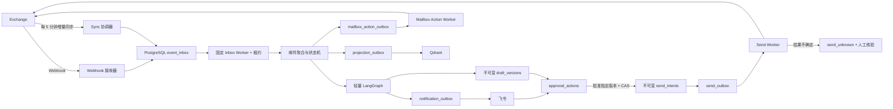
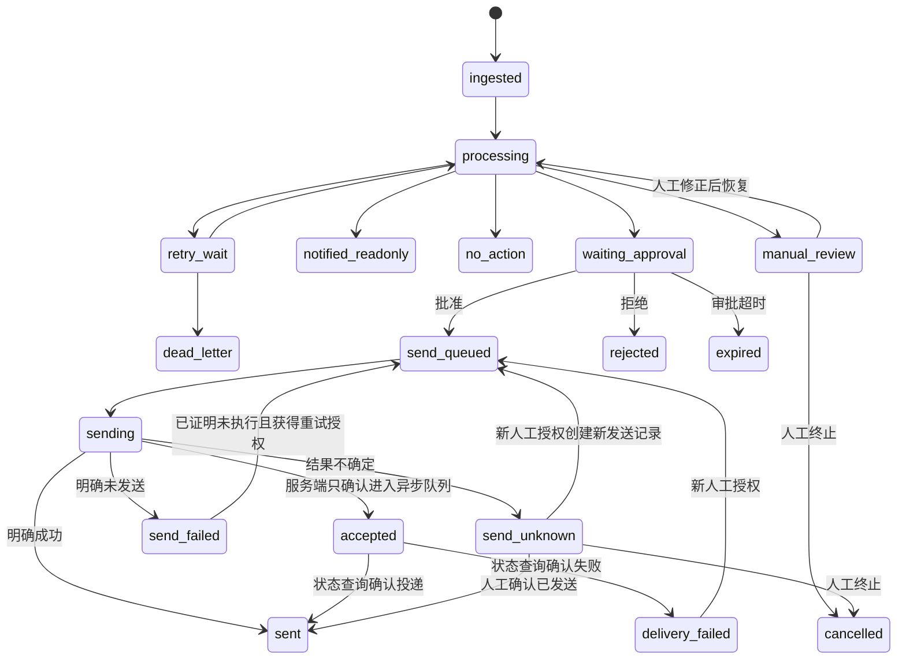
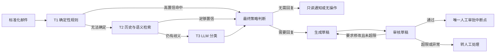

# AI-Exchange 全面可靠性与架构治理设计

**日期**：2026-07-10

**状态**：已通过分段设计评审，待实施计划

**目标项目**：`/Users/jarod/Documents/AI-Exchange`

**关联项目**：`/Users/jarod/Documents/exchange-feishu-extension`（本阶段只读探索，禁止修改）

---

## 1. 背景

AI-Exchange 是一个基于 FastAPI、LangGraph、PostgreSQL、Qdrant、Exchange API 和飞书交互卡片的邮件助手。现有系统能够完成邮件分类、草稿生成、人工审批和发送，但运行态审计表明，其可靠性边界、安全边界和数据生命周期尚未形成闭环。

本次设计的目标不是局部修补，而是在不中断现有业务的前提下，将系统逐步治理为：

- 邮件事件可重复、可乱序、可暂时丢失，但最终不会遗漏；
- 审批事件可以重放，但不会重复发送邮件；
- 所有状态均可恢复、可审计，不依赖单进程内存；
- PostgreSQL 是唯一事实来源，LangGraph 和 Qdrant 都是可恢复的执行或投影组件；
- 邮件正文、附件和敏感配置拥有明确的信任边界与保留期限；
- 运行异常能够被真实指标发现，并有明确恢复手册；
- 改造期间每个阶段可独立验证、部署和回滚。

## 2. 审计基线与主要问题

### 2.1 已验证基线

在设计审计时：

- 单元测试结果为 378 passed、12 skipped；
- 全局测试覆盖率约 53%，若干关键运行模块覆盖率很低；
- Ruff 在当前较窄规则下通过，`pip check` 通过；
- `uv lock --check` 失败，锁文件与依赖声明不同步；
- 没有持续集成配置；
- 应用容器常驻内存接近 2 GiB 的限制；
- PostgreSQL 数据库约 2 GiB，其中 LangGraph checkpoint blob/write 占绝大部分；
- 大量已终态或长期等待审批的历史 checkpoint 未清理；
- 公开健康信息包含真实外部依赖错误，曾出现超过模型百万 Token 上限的请求；
- 现有指标存在声明但未更新、队列实际为空但指标非零等失真情况。

### 2.2 核心风险

当前风险按影响归纳如下：

1. **邮件丢失**：数据库写入失败与“重复邮件”共享布尔返回值，调用方可能误判后把未处理邮件标记已读。
2. **重复或不确定发送**：飞书动作、状态更新和 Exchange 发送之间没有事务 Outbox、动作去重或状态 CAS。
3. **内存与数据库持续膨胀**：完整正文、Base64 附件和图片数据进入 LangGraph State 与 checkpoint。
4. **内存队列不可靠**：Webhook 处理依赖进程内任务，Worker 会快速创建大量子任务，退出时也不能完整回收。
5. **模型故障错误降级**：分类失败会被降级为低优先级、无需回复，外部故障可能变成错误业务决策。
6. **审核循环失效**：Reviewer 要求重写时仍可能展示旧草稿，Graph interrupt 的位置与人审边界不一致。
7. **三级路由顺序漂移**：经验检索发生在分类之后，无法真正影响分类；当前邮件还可能检索到自身。
8. **安全暴露**：原始邮件 HTML、PDF 外部资源、公开 Metrics/内部错误、默认数据库密码、Qdrant/PostgreSQL 主机端口、TLS 降级和日志敏感信息均存在风险。
9. **数据库迁移不可靠**：新数据库上用户迁移可能在基础表创建前执行，运行代码允许更新的字段与实际表结构不一致。
10. **测试可信度不足**：部分集成测试将核心依赖全部 Mock，若干测试永久跳过或使用空断言，无法证明崩溃恢复和并发安全。

## 3. 已批准的关键决策

### 3.1 改造方式

采用**渐进式替换**，而非全量重写或仅做局部补丁：

- 先止血高风险路径；
- 通过新增持久化模型建立可靠基础；
- 在功能开关保护下逐账户切换；
- 同一业务副作用在任意时刻只能有一条有效执行路径；
- 稳定后再移除旧模型与旧代码。

### 3.2 收件方式

采用 **Webhook 实时触发 + 每 5 分钟 Exchange 增量同步兜底**：

- Webhook 负责低延迟；
- `/api/v1/exchange/emails/sync` 负责发现 Webhook 丢失、进程崩溃和投递中断期间的变更；
- 两条入口统一进入 PostgreSQL `event_inbox`；
- Webhook 和 Sync 都不能直接执行模型、飞书或邮件发送副作用。

### 3.3 发送不确定态

现有 Exchange 回复和转发接口没有幂等键或操作状态查询，无法实现端到端 exactly-once。已批准采用以下保守语义：

- 请求尚未发出时的本地前置故障可以安全重试；
- 明确成功响应进入 `sent`；
- 明确证明未执行的响应进入 `send_failed`；
- 超时、断连或可能发生在实际发送之后的 Exchange 500 进入 `send_unknown`；
- `send_unknown` 禁止自动重试，立即发送飞书人工核验任务；
- 只有人工明确确认“未发送”并重新授权，才能创建新的发送任务；
- 未来 Exchange 服务端支持幂等键与状态查询后，再设计安全自动重试。

### 3.4 事实来源

- PostgreSQL 是业务事实来源；
- LangGraph 是轻量工作流编排和短期 checkpoint；
- Qdrant 是可重建的历史经验投影；
- 飞书卡片是交互视图，不是审批状态来源；
- 进程内队列和 `asyncio.Task` 不保存业务事实。

## 4. 目标架构



### 4.1 请求边界

Webhook 请求只完成：

1. 请求格式、大小和 HMAC 校验；
2. 生成去重键；
3. 在数据库事务中插入 Inbox；
4. 返回 `202 Accepted`。

请求线程不获取邮件详情、不调用模型、不上传飞书、不启动不可追踪的后台任务。

### 4.2 增量同步

Sync 协调器按 `account_id + folder` 获取 PostgreSQL advisory lock：

- 从 `sync_cursors` 读取游标；
- 调用 Exchange `/emails/sync`；
- 启动时验证当前 Exchange API Key 具有 `sync` 权限；
- 在同一事务中写入本批 Inbox 事件和新游标；
- 事务失败时不推进游标，下次重取并依靠去重键吸收重复；
- 返回变更数达到批量上限时继续同步，直到本轮无更多变更；
- 游标失效时暂停对应账户，告警后执行受控冷启动同步，不静默丢弃历史。

当前 Exchange 服务端没有 `has_more` 和结构化游标失效响应，因此客户端需要将“满批继续、空批结束”和游标错误分类封装在适配器中。该限制记录为未来服务端改进项，本阶段不修改服务端。

Sync 变更按类型处理：

- 首次 `create` 才能创建邮件聚合并触发分类；
- `update` 只允许刷新尚未产生外部副作用的非终态邮件，不能重新打开终态或再次回复；
- `read` 只更新邮箱投影；本系统发起的 `mark_read` 通过 `email_id + expected_read_state` 与未完成邮箱动作匹配为回写确认，不重新触发流程；
- `delete` 标记源邮件已删除，并在尚未开始发送时取消审批和待发送任务、失效卡片；已经开始的发送尝试仍按原结果记录；
- 服务端缺少可靠事件版本时，以不可逆业务状态、CAS 和审计顺序阻止旧事件倒退状态；
- 首版补偿范围限制为已明确配置的文件夹，不能假设跨文件夹 delete/create 是同一封邮件；
- 冷启动同步必须先输出历史时间窗口、预计数量和样例摘要，经人工确认后分批启用，防止把多年旧邮件批量送入审批流程。

### 4.3 固定 Worker

Inbox、通知、邮箱状态和投影 Worker 使用 `SELECT ... FOR UPDATE SKIP LOCKED` 和租约领取任务：

- Worker 数量固定并可配置；
- 每个任务具有 `lease_until`、尝试次数和下次可执行时间；
- 进程崩溃后，租约到期即可被其他实例重新领取；
- 临时错误指数退避并增加随机抖动；
- 超过上限进入死信并告警；
- 停机时停止领取新任务，等待在途任务，超时后让租约自然恢复；
- 队列深度和最老任务年龄直接查询数据库。

这些通用恢复规则不适用于 Send Worker；发送专用规则见 5.5，任何已经写入发送开始标记的尝试都不能因租约过期自动重放。

## 5. 持久化模型

### 5.1 核心表

| 表 | 职责 | 关键约束 |
|---|---|---|
| `event_inbox` | Webhook/Sync 事件、租约、重试、死信 | `dedupe_key` 唯一 |
| `sync_cursors` | 每账户和文件夹的增量游标 | `(account_id, folder)` 唯一 |
| `emails` | 邮件聚合根与当前业务状态 | `(account_id, external_email_id)` 唯一；`version` 用于 CAS |
| `email_contents` | 正文引用、哈希、类型与生命周期 | 与 `emails` 一对一或版本化 |
| `email_artifacts` | 附件引用、哈希、大小、类型与保留期 | 内容哈希可去重 |
| `draft_versions` | 不可变账户/目标邮件、动作类型、To/Cc/Subject、正文与附件版本及内容哈希 | `(email_id, version)` 唯一；已存在版本只读 |
| `approval_actions` | 飞书动作、操作者、版本和结果 | 动作去重键唯一 |
| `send_intents` | 一次人工授权对应的不可变发送快照和重授权因果链 | `approval_action_id` 唯一；可引用 `supersedes_send_intent_id` |
| `notification_outbox` | 飞书消息、稳定 `card_key`、审批版本和外部卡片 ID | 业务去重键唯一；远端语义为 at-least-once |
| `send_outbox` | Exchange send/reply/forward 唯一发送入口 | `send_intent_id` 唯一；重授权创建新记录并引用旧记录 |
| `mailbox_action_outbox` | 已读、移动等邮箱状态副作用 | 邮件、操作和目标状态组合唯一 |
| `audit_events` | 只追加的业务和人工审计 | 不原地修改历史 |
| `projection_outbox` | Qdrant 等投影任务 | 投影业务键唯一 |
| `pipeline_ownership` | 账户切换代次、执行管线、状态与 fencing token | `(account_id, generation)` 唯一；部分唯一约束保证每账户仅一个 `current_ingress` |

### 5.2 Inbox 去重

去重键是输入幂等优化，而不是唯一正确性边界：

- Webhook 优先使用账户、事件类型、稳定邮件标识和事件版本/时间组合；
- 字段不足时回退为经过规范化的原始请求体哈希；
- Sync 使用账户、文件夹、变更类型、邮件标识和版本/游标批次构造；
- 即使两个来源生成不同事件键，`emails` 的外部邮件唯一键和状态 CAS 仍可阻止重复业务处理。

### 5.3 邮件状态机



所有状态转换由仓储层集中定义允许的来源状态、目标状态和副作用。禁止业务节点直接拼接 SQL 更新任意状态。

图中任何从既有发送结果返回 `send_queued` 的箭头，都是邮件聚合状态的变化，不是复用旧 Send Outbox。旧发送记录保持不可变；新的 `approval_action_id` 创建新的 `send_intents` 和 Outbox，并通过 `supersedes_send_intent_id`/旧尝试引用保留完整因果链。

`manual_review` 用于验证错误、无法可靠分类、Reviewer 超限和需要人工修正的非发送故障；`dead_letter` 只允许管理员通过带原因的恢复动作重新入队。`send_failed` 仅表示有证据证明远端没有执行，`delivery_failed` 表示异步发送已被服务端接受但最终投递失败，两者都不能复用旧审批动作静默重发。

### 5.4 原子审批

一次批准操作必须在同一 PostgreSQL 事务完成：

1. 写入 `approval_actions`；
2. 校验卡片引用的 `draft_version_id`、内容哈希、审批人和审批版本；
3. 按 `email_id + status + version` CAS 更新 `emails`；
4. 将该草稿版本的账户、目标邮件、正文/附件引用、动作类型、最终 To/Cc/Subject 和内容哈希冻结为新的 `send_intents`；
5. 创建唯一引用该意图的 `send_outbox`；
6. 写入 `audit_events`。

任何一步失败则整体回滚。重复卡片点击返回幂等的“已处理”结果，不重复创建发送任务。

`send_outbox` 覆盖 `reply`、`forward` 和普通 `send`，并保存外部响应摘要、远端操作 ID 或 `log_id`。普通 `/send` 的 HTTP 200 只表示服务端已经接收并排队，必须进入 `accepted` 而不是伪装成 `sent`；只有状态查询或人工确认后才更新最终投递结果。当前服务端没有可靠操作状态查询时，超龄 `accepted` 必须告警并保持未确认状态，不能推断为已投递。同步 reply/forward 的明确 2xx 可以进入 `sent`，其超时、断连和可能在发送后发生的 5xx 进入 `send_unknown`。

草稿和发送意图必须不可变：

- 模型重写、Reviewer 修改或用户编辑都会创建新的 `draft_versions` 记录；
- 审批卡只批准一个明确版本和内容哈希；
- 如果卡片支持就地编辑，提交时必须在同一审批事务中先冻结用户看到的最终快照，再批准该快照；
- 新版本生成后，引用旧版本的卡片自动失效；
- Send Worker 只读取 Outbox 引用的不可变 `send_intents`，禁止重新读取可变 Graph State 或 `emails` 中的草稿字段。

### 5.5 发送尝试的特殊恢复规则

Send Worker 不能复用普通 Outbox 的“租约过期后自动重领并重试”规则。由于服务端暂不支持幂等键，发送尝试采用保守的写前状态：

1. 在发起网络请求前，事务性写入唯一 `attempt_id`、`request_started_at` 和 `sending`；
2. 事务提交后才允许发起 Exchange 请求；
3. 一旦 `request_started_at` 存在，任何进程崩溃、租约过期或结果缺失都必须由恢复扫描转成 `send_unknown`，绝不能回到自动可执行队列；
4. 只有尚未写入 `request_started_at` 的本地前置任务可以重新领取；
5. 明确响应按批准的成功、失败、`accepted` 或 `send_unknown` 规则落库；进入 `send_unknown` 时，邮件状态、发送尝试、审计事件和高优先级飞书告警 Outbox 必须在同一数据库事务提交；
6. 从 `send_unknown` 再次发送必须创建新的人工授权、新的 `send_intents` 和新的 Send Outbox 记录。

这会把“请求实际上没有发出但进程恰好崩溃”的情况也保守地归入人工核验，但可以保证客户端不会因为恢复逻辑自动重复发送。

### 5.6 邮箱状态副作用

标记已读、移动文件夹等操作不能直接夹在业务处理函数中：

- `mark_read` 只允许在邮件业务状态已经可靠持久化后写入 `mailbox_action_outbox`；
- 需要飞书通知的邮件，默认在通知 Outbox 明确投递成功后才创建 `mark_read`；
- 明确 `no_action` 的邮件可在策略结果落库后创建 `mark_read`；
- `mark_read` 是幂等动作，可以按已分类的临时错误重试；
- 当前 Exchange 服务端没有移动邮件接口，因此 AI-Exchange 必须禁用或明确失败该能力，不能假装成功；
- 未来实现移动接口后，再通过同一 Outbox 模型启用。

### 5.7 通知投递语义

飞书目前不能提供与本地事务原子绑定的消息创建，因此通知采用 at-least-once：远端已创建卡片但本地确认丢失时，重试可能产生重复卡片。该重复不能转化为重复业务副作用：

- 同一业务通知使用稳定 `card_key`、审批 Token、`draft_version_id` 和审批版本；
- SDK/API 支持幂等请求标识时必须使用稳定标识；
- `notification_outbox` 记录所有已知外部 message/card ID，便于统一更新和失效；
- 任意一张重复卡片上的操作最终都进入同一动作去重键和 CAS；
- 审批完成、拒绝、过期或被新草稿替代后，后台任务统一更新或失效所有关联卡片；
- 卡片远端成功、本地提交失败的故障必须有专门注入测试。

### 5.8 迁移所有权

- 应用业务表统一由 Alembic 管理；
- 阶段 1 即创建与现有生产结构一致的 Alembic baseline；旧临时迁移器冻结，不再新增 DDL，并在现有实例完成版本盖章后退役；
- LangGraph checkpoint 表继续由上游 checkpointer 管理，但通过独立部署命令显式执行；
- 由于当前 checkpoint PostgreSQL 版本的部分迁移使用 `CREATE INDEX CONCURRENTLY`，执行连接必须开启 autocommit；
- 应用启动时只检查数据库是否位于预期版本，不在业务进程启动路径中隐式执行任意 DDL；
- 版本落后时 readiness 失败并给出安全摘要，由部署流程先完成迁移；
- CI 必须同时验证空数据库、现有结构快照升级和重复运行幂等性。

## 6. 内容存储与 LangGraph 边界

### 6.1 内容存储

邮件详情只抓取一次并标准化：

- 元数据写入 `emails`；
- 正文通过 `ContentStore` 保存并由 `email_contents` 引用；
- Base64 附件立即解码到受控存储，记录在 `email_artifacts`；
- 记录哈希、实际类型、大小和生命周期；
- 节点按需临时读取，使用结束立即释放；
- `ContentStore` 首版可使用受控持久卷，但生产实现必须具备静态加密能力，不得将敏感正文或附件明文写入临时目录；内容记录保存密钥版本，并支持未来迁移至带服务端加密的对象存储。

内容去重只能在同一账户/租户安全域内进行，唯一键使用 `(account_id, content_hash)`。每个内容对象维护引用计数或显式引用关系；只有引用数为零、保留期已到且没有 `send_unknown`/审计保全标记时，安全 GC 才能删除对象。临时文件使用受控目录、随机文件名和最短生命周期，异常退出后的残留由启动扫描清理。

阶段 1 必须先交付最小可用的持久化 ContentStore 和 `content_ref`：正文及必要附件原子写入受控加密存储后，Graph 才能只保存引用，并能在进程重启后重新加载内容。阶段 4 负责完善多后端抽象、历史内容迁移、附件去重、密钥轮换和完整生命周期治理，不能等到阶段 4 才提供第一个内容引用存储。

### 6.2 Graph State

Graph State 只允许保存小型、可序列化的工作流信息，例如：

```text
email_id
workflow_run_id
classification
priority
need_reply
draft_id
review_result
routing_decision
small error summary
```

禁止保存：

- 完整正文或原始 HTML；
- Base64、图片字节或完整附件；
- 完整模型请求和响应；
- 完整飞书卡片 JSON；
- 可重新从数据库加载的大型派生对象。

节点只返回自己负责字段的增量，禁止返回整份 State。Reducer 只用于确实需要追加语义的字段。

### 6.3 Checkpoint 生命周期

- 运行中和等待审批保留轻量 checkpoint；
- 终态流程保留紧凑审计摘要，checkpoint 在 24 小时内删除；
- 等待审批默认 7 天过期，通知后进入 `expired` 并清理 checkpoint；
- 所有清理先 dry-run、后备份、再分批执行；
- 未完成迁移的等待审批、`accepted` 和 `send_unknown` 数据禁止自动删除。

## 7. 分类、草稿与审核流程



规则如下：

- T2 必须在最终分类之前完成；
- 当前邮件在检索历史时尚未写入 Qdrant，不能检索到自身；
- Reviewer 要求修改时，必须重新生成并审核新草稿；
- 只有 Reviewer 通过后才允许发送审批卡片和 Graph interrupt；
- 重写次数有上限，超限转人工；
- 模型故障不得默认解释为“不需要回复”；
- 数据库、Exchange、飞书、模型和 Qdrant 依赖通过明确 Port/Adapter 注入，移除全局对象和动态导入上下文。

Qdrant 由 `projection_outbox` 异步更新，使用稳定 Point ID 和可重放 Upsert。任务只有在 Qdrant 明确确认写入后才完成（客户端使用等待提交语义），投影失败不影响业务状态，但必须重试和告警。

## 8. 故障语义与模型网关

### 8.1 统一错误分类

| 错误类别 | 默认处理 |
|---|---|
| `validation_error` | 终止事件，进入死信或人工处理 |
| `authentication_error` | 暂停对应依赖并立即告警 |
| `rate_limited` | 按服务端提示或退避策略延迟重试 |
| `transient_dependency_error` | 有上限地重试 |
| `permanent_dependency_error` | 终止并告警 |
| `policy_rejected` | 记录正常业务结果 |
| `send_unknown` | 禁止自动重试，等待人工核验 |
| `internal_invariant_error` | 中止状态转换并高优先级告警 |

数据库错误、重复数据和业务无操作必须使用不同类型表达，不能再共享布尔值。

### 8.2 模型网关

所有模型角色统一通过一个网关：

- 统一限流、并发、超时、重试、断路器、Token 预算和指标；
- 只保留一个重试层，只有已分类的临时错误允许重试；
- 每个角色配置最大输入、输出和总 Token；
- 超长正文采用确定性裁剪、引用分离或分块摘要；
- 仍超限时转人工，禁止发送超大模型请求；
- 角色名称和配置键在启动时校验；
- 所有结构化输出通过 Schema 验证；
- 解析失败不得产生“无需回复”等业务默认值。

### 8.3 外部模型数据治理

- 模型供应商、模型和数据地域使用明确允许列表，并可按账户关闭外部模型处理；
- 只选择合同或配置明确禁止训练、限制保留期且满足组织数据政策的端点；
- 发送前最小化 PII、历史引用和无关签名，只传递完成当前角色所需内容；
- 附件默认不发送给外部模型，只有允许的文件类型和明确启用的分析角色可以读取；
- 审计记录供应商、模型、角色、数据类别、Token 数和策略版本，但不记录原文；
- 供应商切换不能绕过账户策略、地域约束、Token 闸门或脱敏规则。

## 9. 安全设计

### 9.1 Webhook 与服务接口

- 基于原始请求字节验证 HMAC，并使用恒定时间比较；
- 限制方法、Content-Type 和请求体大小；
- 当前 Exchange 时间戳没有签入 HMAC，因此不能单独用于防重放；
- 合法重放由 Inbox 去重吸收；
- `/health` 只返回进程状态、版本和时间；
- `/ready` 判断是否具备接单能力；
- `/metrics` 只允许内部网络或监控凭据访问；
- 管理、重试、死信恢复和人工确认接口必须认证、幂等并写审计。

### 9.2 飞书授权

- 配置允许访问机器人的用户或用户组；
- 搜索、待审批列表和邮件详情按操作者过滤；
- 卡片绑定邮件、审批版本、允许审批人和过期时间；
- 操作时校验事件签名、操作者、卡片版本和邮件状态；
- 管理员代处理必须明确标记并审计；
- 完整卡片、草稿和 Token 不进入生产日志。

### 9.3 HTML、PDF 与附件

- 原始邮件 HTML 不直接渲染；
- 预览优先通过飞书 OAuth/SSO 会话验证真实 `open_id`；链接中的用户字段本身不能视为身份；
- 无法直接完成 SSO 时，使用带 `aud/sub/nonce/exp` 的一次性 Token 换取 HttpOnly 会话 Cookie，消费后立即失效并重定向到不含 Token 的 URL；
- 预览服务使用独立沙箱 Origin，代理和应用访问日志禁止记录 Token 查询参数；
- HTML 严格白名单清洗，移除脚本、表单、iframe、事件属性和危险协议；
- 默认阻断远程图片、跟踪像素和外部 CSS；
- 设置严格 CSP、`Referrer-Policy: no-referrer` 和 `Cache-Control: no-store`；
- PDF 使用自定义资源加载器，禁止互联网、宿主机文件和内部地址；
- 附件校验文件魔数、单个大小、总大小、数量、图片像素和压缩比；
- 可执行文件、宏文件和危险压缩包拒绝或隔离。

### 9.4 提示注入

- 邮件正文和附件始终标记为不可信数据；
- 邮件内容不能覆盖系统策略或授权边界；
- 模型没有直接发送邮件、读取任意文件或访问内部网络的权限；
- 模型输出只能通过受控 Schema 和业务策略转化为状态；
- 所有真实副作用由确定性服务执行。

### 9.5 TLS、密钥与网络

- 生产环境强制验证 Exchange TLS；
- 删除证书错误后自动 `verify=False` 的降级；
- 企业自签证书通过明确 CA 文件处理；
- 出站 Exchange、模型和飞书目标使用域名允许列表；
- 启动时拒绝示例密钥和默认密码；
- PostgreSQL 和 Qdrant 仅位于内部 Docker 网络，不映射至 `0.0.0.0`；
- FastAPI 由反向代理提供 TLS、请求限制和日志脱敏；
- 容器非 root、最小权限、只读根文件系统，并设置资源限制；
- 生产镜像移除测试工具、编译器和开发依赖。

### 9.6 数据保留

默认策略：

| 数据 | 默认保留时间 |
|---|---|
| 终态邮件正文和临时附件 | 30 天 |
| 等待审批内容 | 至审批完成或过期 |
| 未解决的 `accepted`/`send_unknown` 完整发送快照 | 保留至人工解决；解决后 Payload 再保留 30 天 |
| Inbox 原始载荷 | 成功处理后 7 天；死信至解决后 30 天 |
| 草稿版本、发送意图及通知/发送 Outbox Payload | 终态后 30 天；审计字段按下方期限保留 |
| 预览、PDF 缓存和临时文件 | 请求结束即删，最长不超过 24 小时 |
| 终态 Graph checkpoint | 24 小时内清理 |
| Qdrant 向量和脱敏摘要 | 与对应邮件内容保留策略同步删除 |
| 脱敏应用日志与 Trace | 30 天 |
| 业务状态和普通审计元数据 | 180 天 |
| `send_unknown`、安全事件和人工操作的脱敏审计元数据 | 365 天 |
| 加密备份 | 依据部署备份策略，默认 30 天并验证可恢复性 |

365 天审计只保留结果、内容哈希、最小化/脱敏后的参与者标识、时间和因果链，不保留正文、完整收件人列表或附件内容。期限全部可配置。清理任务必须支持 dry-run、批量上限、执行统计和失败恢复；删除邮件内容时同时通过投影 Outbox 删除 Qdrant 数据。备份、死信和 Outbox 不能成为绕过正文保留期的永久敏感副本。

## 10. 可观测性与运维

### 10.1 关联标识

日志、Trace 和审计使用：

- `request_id`；
- `workflow_run_id`；
- `email_id`；
- `inbox_id`；
- `outbox_id`。

这些高基数标识不得作为 Metrics Label。指标只使用账户类别、阶段、结果和错误类别等受控低基数维度。

日志默认不记录正文、附件、完整主题、完整地址、完整请求头、签名、密钥或卡片 JSON。

### 10.2 必备指标

- Inbox 数量、最老年龄、重试和死信；
- 每账户 Sync 延迟、游标更新时间和每轮变更数；
- 各工作流阶段吞吐、耗时与错误分类；
- 处理中、等待审批、过期、超龄 `accepted` 和 `send_unknown` 数量；
- Outbox 数量、最老年龄和投递延迟；
- 模型各角色调用、耗时、Token、失败、重试和断路器；
- Exchange、飞书、PostgreSQL、Qdrant 的延迟和错误率；
- checkpoint 数量、体积和清理量；
- 主要数据库表体积与日增长；
- RSS、容器内存、事件循环延迟、任务数和连接池使用率；
- Qdrant 投影延迟与失败。

未接入真实执行点的假指标应删除，不能继续展示错误数据。

### 10.3 默认告警

- 最老 Inbox 事件超过 5 分钟；
- Sync 超过两个周期未成功；
- 任意 `send_unknown`；
- `accepted` 超过配置的投递确认期限；
- 新增死信；
- 等待审批超过期限；
- Outbox 最老任务超过 5 分钟；
- checkpoint 或数据库增长异常；
- 容器内存持续超过 80%，超过 90% 升级；
- 模型连续失败或断路器打开；
- Exchange 或飞书认证失败。

每个告警链接对应 Runbook，并只包含安全元数据。

## 11. 测试与工程质量

### 11.1 测试分层

1. **单元测试**：状态转换、去重键、错误分类、规则、清洗器、Token 预算。
2. **并发与状态机测试**：重复 Webhook、重复审批、Worker 抢占、租约过期、审批/过期竞争。
3. **数据库集成测试**：真实 PostgreSQL 上的事务、唯一约束、`SKIP LOCKED`、Outbox 和迁移。
4. **契约测试**：Exchange Webhook、Sync、详情、回复、转发及飞书事件。
5. **故障注入测试**：事务提交、Outbox 投递、模型、飞书和 Exchange 发送关键位置崩溃。
6. **安全测试**：错误 HMAC、重放、越权、恶意 HTML、SSRF、超大附件、压缩炸弹、提示注入。
7. **性能与稳定性测试**：大正文、多附件、突发事件和持续运行；验证内存不随累计邮件线性增长。

以下场景是不可跳过的发布门禁：

- Exchange 已执行发送、Worker 在本地提交前崩溃，恢复后只能进入 `send_unknown`；
- 审批后尝试修改正文、收件人、附件或动作类型，Send Worker 仍只能读取已批准快照；
- `send_unknown` 重新授权会创建新动作和新发送记录，原尝试不会变化；
- 飞书建卡成功但本地确认丢失，重复卡片操作仍只能产生一次业务状态转换；
- 管线切换时旧 Worker 持有过期 fencing token，不能提交或执行新副作用；
- 回滚后已返回 202 的 Inbox 和已有 Outbox 均有明确所有者并最终排空；
- Sync 的 create/update/read/delete 乱序不会重开终态或重复回复；
- 内容引用计数、保留期和 `send_unknown` 保全标记能阻止过早 GC。

关键可靠性模块覆盖率目标至少 90%，全局覆盖率通过 ratchet 从当前约 53% 提升至至少 80%。禁止以空断言或永久跳过测试达标。

### 11.2 CI

每次提交至少执行：

```text
格式与静态检查
类型检查
单元测试
PostgreSQL 集成测试
安全扫描
依赖锁定检查
Docker 构建
空数据库迁移
现有数据库快照升级
```

同时要求：

- `uv.lock` 与依赖声明同步；
- 依赖和基础镜像固定版本或摘要；
- 多阶段 Docker 构建；
- 生成 SBOM 并扫描高危漏洞和密钥；
- Exchange/OpenAPI 契约快照防止意外漂移。

## 12. 迁移策略与阶段

所有数据库和运行切换采用 expand–migrate–switch–contract，不做大爆炸迁移。

### 阶段 0：保护现场与基线

- 审查并保留当前未提交修改；
- 记录测试、覆盖率、依赖、镜像、数据库和内存基线；
- 保存数据库结构和关键表体积快照；
- 每个提交只暂存本阶段明确文件；
- Exchange 服务端继续只读。

### 阶段 1：P0 止血

- 区分数据库错误和重复邮件；
- 持久化失败前禁止标记已读；
- 模型错误不再降级为无需回复；
- 在 HTTP 响应接收、正文、附件数量/总量和任何模型调用前实施硬上限，超限转人工，立即阻断百万 Token 请求；
- 直接建立 Alembic baseline，并用首批迁移修复新数据库启动顺序和字段漂移；旧临时迁移器自此冻结；
- 用固定消费者替换无限创建子任务的方式，并追踪所有在途任务；
- 临时阻断重复审批和发送；
- 立即启用飞书最小允许名单与卡片操作者校验，关闭或认证原始预览；
- 立即收敛 `/health`、`/metrics` 和日志敏感字段，拒绝默认凭据；
- 强制 Exchange TLS 校验，并停止公开 PostgreSQL/Qdrant/Metrics 的生产端口；
- 交付最小持久化、静态加密的 ContentStore 和 `content_ref`，保证剥离正文后流程仍可跨重启恢复；
- 停止向新 checkpoint 写入正文、HTML、Base64、图片字节、完整附件和大型派生对象；
- 停用当前断开但仍复制图片数据的无效分析路径；
- 对历史 checkpoint 先输出 dry-run、完成备份，再分批清理已经映射确认的终态记录；
- 每批清理监控锁等待、数据库体积和服务延迟，可随时停止，不触碰等待审批与结果不确定记录。

### 阶段 2：持久化收件

- 在阶段 1 Alembic baseline 上新增核心业务表和迁移版本检查；
- LangGraph 迁移通过受控 autocommit 引导命令执行；
- 分批、幂等迁移历史数据；
- Webhook 改为持久化快速接收；
- 实现固定 Worker、租约、重试和死信；
- 在新领域处理器完成前，由 Durable Worker 通过兼容适配器调用旧处理逻辑，使已返回 202 的事件始终有消费者；
- 实现每 5 分钟 Sync 补偿；
- 先影子比较，再启用正式补偿。

### 阶段 3：审批与发送可靠性

- 动作 Inbox、授权、去重和 CAS；
- 不可变 `draft_versions` 与审批内容哈希；
- 通知 Outbox、发送 Outbox 和邮箱状态 Outbox；
- Send Worker 成为唯一发送入口，并使用发送专用的写前尝试状态；
- 实现 `send_unknown`、不可复用旧任务的人工重新授权；
- 逐账户/代次切换；允许旧代次排空，但同一邮件和 `send_intents` 在任何时刻只能由一个 Sender generation 执行。

### 阶段 4：LangGraph 与内容重构

- 完善阶段 1 的 `ContentStore` 多后端抽象、历史迁移、去重、密钥轮换和附件生命周期；
- 轻量 Graph State；
- 节点增量和 Reducer 修正；
- T1 → T2 → T3 顺序；
- Reviewer 循环和唯一人审中断点；
- 模型网关和 Token 预算；
- Qdrant Outbox 投影；
- 移除断开的图片分析路径或按需正确接入。

### 阶段 5：完整安全加固

- 在阶段 1 最小允许名单之上完成飞书角色权限、管理员代办和授权审计；
- 独立预览 Origin、SSO/一次性会话、HTML/PDF/附件完整安全控制；
- 外部模型供应商、地域、保留和 PII 最小化策略；
- TLS、管理接口、Metrics 和内部网络隔离；
- 非 root 和最小生产镜像；
- 日志脱敏、密钥校验和数据保留任务。

### 阶段 6：性能、观测和工程质量

- 消除异步路径中的同步阻塞；
- Exchange 详情有限并发或批处理；
- 连接池、限流器和断路器生命周期修复；
- 指标、告警和 Runbook；
- 真实集成测试、故障注入和 CI；
- 修复锁文件、固定依赖和镜像；
- 更新 README、`CLAUDE.md`、OpenAPI 和架构文档。

### 阶段 7：历史治理与最终切换

- 备份并 dry-run；
- 只清理已迁移终态数据；
- 等待审批、`accepted` 和 `send_unknown` 逐项确认；
- 分批清理 checkpoint 并观察数据库锁和延迟；
- 停止旧表写入并提供兼容视图；
- 稳定后移除旧代码、旧迁移器和旧状态字段；
- 输出最终架构审计和生产验收报告。

## 13. 功能开关与回滚

建议至少提供以下开关，并支持按账户启用：

- `DURABLE_INBOX_ENABLED`；
- `SYNC_RECONCILIATION_ENABLED`；
- `NEW_APPROVAL_FLOW_ENABLED`；
- `SEND_OUTBOX_ENABLED`；
- `LIGHTWEIGHT_GRAPH_STATE_ENABLED`；
- `QDRANT_OUTBOX_ENABLED`。

原则：

- 影子模式只比较输入和决策，不执行飞书或 Exchange 副作用；
- 功能开关只表达期望，数据库 `pipeline_ownership` 才是执行所有权事实；
- 每个账户只能有一个接收新事件的 `current_ingress` generation，可以同时存在零到多个只处理既有任务的 `draining` generation；清空并对账后的代次进入 `retired`；
- 每个 generation 具有执行管线、状态和单调递增 fencing token；每封邮件、Inbox 和 Outbox 都固化所属 generation；
- 邮件一旦进入审批或生成发送意图，就保持逐邮件粘性归属，不能因账户级开关变化自动切换 Sender；
- `current_ingress` 可以接收新事件并领取本代任务；`draining` 只能领取切换前已经归属本代的任务，禁止接收或创建跨代新任务；`retired` token 完全失效；
- 所有任务领取和提交都比较任务 generation 与对应有效 fencing token，Worker 不能处理其他代次的数据；
- 发送切换前先将当前代次置为 `quiescing`，停止新领取，等待所有在途发送得到明确结果或转入 `send_unknown`，然后再将其置为 `draining` 并创建新的 `current_ingress`；
- 旧审批迁移必须逐封创建新不可变草稿版本、失效旧卡片并写审计，不能批量改一个账户开关；
- 回滚创建一个指向稳定管线的新 `current_ingress`；问题代次转为 `draining`，已经接收的 Inbox/Outbox 继续按其原 token 安全排空，或经过显式、可审计的数据迁移后再移交；
- Webhook 已返回 202 的事件不得因回滚变成旧管线不可见的滞留数据；
- 已进入 `send_unknown` 的任务不能因回滚自动重放；
- 数据库迁移优先向前修复，不依赖破坏性 down migration；
- 收缩旧表和旧字段必须在稳定观察后单独执行。

数据所有权矩阵：

| 运行阶段 | 权威收件 | 处理器 | 飞书/Exchange 副作用 | 回滚责任 |
|---|---|---|---|---|
| 基线 | 旧 Webhook 路径 | 旧处理器 | 旧路径 | 旧路径 |
| Inbox 影子 | 旧路径；新 Inbox 仅比对 | 旧处理器 | 旧路径 | 丢弃影子执行权，保留审计数据 |
| Durable Inbox 切换 | 新 Inbox | Durable Worker 调用兼容旧处理适配器 | 旧副作用路径 | 新 Worker 继续排空 Inbox，不能退回不可见旧入口 |
| 新审批/发送切换 | 新 Inbox | 按邮件 generation 粘性路由 | 新 Outbox；旧邮件仅在明确旧归属下处理 | 新 Outbox 继续排空或显式迁移，禁止旧 Sender 接管 |
| 完整切换 | 新 Inbox | 新 Graph/领域服务 | 新 Outbox | 通过新 generation 前向修复 |

每次切换必须执行以下协议：

1. 停止目标账户接收新的旧管线任务；
2. 等待在途任务并处理所有 `sending` 状态；
3. 对账旧管线高水位、Inbox/Outbox 数量和邮件状态；
4. 在事务中把旧代次转为 `draining`，并创建具有新 generation/fencing token 的唯一 `current_ingress`；
5. 新事件只固化到新的 `current_ingress`，旧代次只排空既有任务；
6. 观察并核对 Webhook 与 Sync 数量；
7. `draining` 代次清空并通过高水位对账后转为 `retired`；只有验收通过后才允许收缩旧路径。

## 14. 验收标准

最终必须以自动化测试和运行证据证明：

1. Webhook 丢失时，Sync 能恢复邮件；
2. 重复、乱序的 create/update/read/delete 不会重开终态或重复处理；
3. 数据库故障不会把未处理邮件标记已读；
4. 重复审批不会重复创建发送任务；
5. 审批后的正文、收件人、附件和动作类型不能被后续修改；
6. 不确定发送以及发送开始后的进程崩溃不会自动重试；
7. `send_unknown` 重新授权创建新发送记录，原尝试保持不可变；
8. 进程崩溃不会丢失 Inbox 或 Outbox；
9. 飞书重复卡片不会产生重复业务副作用；
10. 管线切换和回滚期间，generation/fencing 与逐邮件归属能阻止双写和任务滞留；
11. Reviewer 重写后只展示最新审核通过的草稿；
12. 模型失败不会变成“无需回复”的静默业务结果；
13. 邮件只在业务结果可靠持久化、必要通知投递完成后才标记已读；
14. 大附件不进入 checkpoint，内存和 checkpoint 不随累计邮件持续增长；
15. `send_unknown`、内容引用和保留策略不会造成过早清理或永久敏感副本；
16. 新数据库和现有数据库升级均可启动；
17. 原始 HTML、密钥、内部错误和内部数据端口不公开；
18. 核心异常均有真实指标、告警和恢复手册；
19. 全局测试覆盖率达到至少 80%，可靠性关键模块至少 90%；
20. 锁文件、静态检查、类型检查、测试、迁移和镜像构建全部通过；
21. 旧执行路径停止承担业务职责后方可移除。

性能验收不只使用单个固定 RSS 数值，而是使用可复现负载证明：

- 空闲和稳定负载下存在明确资源余量；
- 处理累计邮件后 RSS 不出现单调增长；
- 大正文和附件处理结束后内存可回收；
- checkpoint 总量受到审批数量和保留策略约束，而不是累计邮件总量。

## 15. Exchange 服务端后续边界

`/Users/jarod/Documents/exchange-feishu-extension` 本阶段只读。当前已确认：

- Webhook 具有数据库投递记录和重试，但进入数据库前仍经过进程内队列；
- Webhook 没有稳定 `event_id/delivery_id`，时间戳未纳入签名；
- `/emails/sync` 可用于客户端增量补偿，但缺少 `has_more` 和结构化游标重置语义；
- 回复和转发没有幂等键与操作状态查询；
- AI-Exchange 当前依赖的移动邮件接口在服务端不存在。

当前项目验收后，再为服务端单独设计：

- 稳定事件信封和签名时间戳；
- 数据库 Outbox 与待投递恢复扫描；
- Sync `has_more/reset_required`；
- 发送幂等键、操作 ID 和状态查询；
- 移动邮件接口；
- 更完整的契约、认证和故障测试。

在此之前，AI-Exchange 必须把服务端事件视为“可能重复、乱序和遗漏的提示”，并通过自己的 Inbox、幂等和 Sync 补偿保证正确性。

## 16. 明确不在当前设计范围内的事项

- 当前阶段不修改 Exchange 服务端代码；
- 不引入微服务拆分，先保持单体内的清晰模块边界；
- 不承诺在服务端缺少幂等能力时实现回复/转发 exactly-once；
- 不用 Qdrant、飞书卡片或 LangGraph checkpoint 替代 PostgreSQL 业务状态；
- 不在没有备份、dry-run 和状态映射的情况下直接删除历史 checkpoint；
- 不因架构治理改变已经批准的邮件通知业务规则，除非测试证明现有规则本身有缺陷并再次评审。

## 17. 文档交付与后续步骤

设计批准后的执行顺序：

1. 对本设计进行独立自审；
2. 使用 `writing-plans` 将每个阶段拆成逐文件、逐测试、可执行的小任务；
3. 先实施阶段 0 和阶段 1；
4. 每阶段运行相应测试和全量回归；
5. 每阶段形成验证报告并检查工作区，避免混入用户已有修改；
6. 当前项目全部验收后，另起服务端设计与实施计划。
